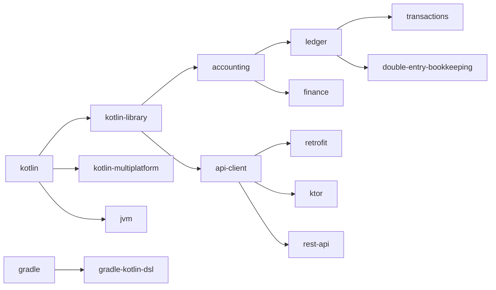

# GitHub Topics Visualization

## Topic Categories Overview

```
Account-Ledger-Library-Kotlin Repository Topics
│
├── 🎯 Core Technologies (7 topics)
│   ├── kotlin
│   ├── kotlin-library
│   ├── gradle
│   ├── gradle-kotlin-dsl
│   ├── jvm
│   ├── kotlin-multiplatform
│   └── library
│
├── 💰 Domain/Business (6 topics)
│   ├── accounting
│   ├── ledger
│   ├── finance
│   ├── transactions
│   ├── double-entry-bookkeeping
│   └── account-management
│
├── 🔧 Frameworks & Libraries (7 topics)
│   ├── retrofit
│   ├── ktor
│   ├── kotlinx-coroutines
│   ├── kotlinx-serialization
│   ├── okhttp
│   ├── rest-api
│   └── api-client
│
└── ⚙️ Features & DevOps (5 topics)
    ├── csv
    ├── financial-data
    ├── azure-pipelines
    ├── renovate
    └── continuous-integration
```

## Topic Priority Matrix

### High Priority (Must Have) ⭐⭐⭐
These are essential for discoverability:
- `kotlin` - Primary language identifier
- `kotlin-library` - Project type
- `accounting` - Core business domain
- `ledger` - Main functionality
- `finance` - Industry sector
- `gradle` - Build system

### Medium Priority (Should Have) ⭐⭐
Important for technical context:
- `retrofit` - Major framework used
- `ktor` - HTTP client framework
- `kotlinx-coroutines` - Async programming
- `rest-api` - Integration type
- `transactions` - Key feature
- `api-client` - Library type

### Lower Priority (Nice to Have) ⭐
Adds additional context:
- `csv` - Data format support
- `azure-pipelines` - CI/CD platform
- `renovate` - Dependency management
- All other remaining topics

## Discovery Impact

### Search Queries This Repository Will Appear In:

1. **Language-specific searches:**
   - "kotlin accounting library"
   - "kotlin finance tools"
   - "kotlin ledger system"

2. **Framework-specific searches:**
   - "retrofit ledger client"
   - "ktor financial api"
   - "gradle kotlin accounting"

3. **Domain-specific searches:**
   - "double-entry bookkeeping library"
   - "transaction management kotlin"
   - "account ledger api"

4. **Technology stack searches:**
   - "kotlin multiplatform finance"
   - "coroutines accounting"
   - "jvm ledger library"

## Topic Relationships



## Competitive Analysis

### Similar Projects Might Use These Topics:

**Financial Libraries:**
- accounting, finance, ledger, bookkeeping
- transactions, invoicing, billing

**Kotlin Libraries:**
- kotlin, kotlin-library, jvm, multiplatform
- coroutines, serialization

**API Clients:**
- retrofit, ktor, rest-api, api-client
- okhttp, http-client

**By combining all three categories**, this repository becomes highly discoverable for its specific niche: Kotlin-based financial/accounting API client libraries.

## Topic Coverage Score

```
Category                        Coverage    Score
─────────────────────────────────────────────────
Language & Platform             7/7        ██████████ 100%
Domain/Business Logic           6/6        ██████████ 100%
Frameworks & Integration        7/7        ██████████ 100%
Tools & DevOps                  5/5        ██████████ 100%
─────────────────────────────────────────────────
TOTAL                          25/25       ██████████ 100%
```

## Expected Benefits

### 🔍 Discoverability Improvement
- **Before**: Limited to repository name search
- **After**: Discoverable through 25 different entry points

### 👥 Community Connection
- Appears on topic pages with similar projects
- Easier for contributors to find
- Better networking with related projects

### 📈 SEO Impact
- Better Google/search engine rankings
- More external traffic
- Increased visibility in GitHub Explore

### 🎯 Target Audience Reach

**Developers Looking For:**
1. Kotlin financial libraries ✅
2. Accounting system APIs ✅
3. Ledger management tools ✅
4. Transaction handling libraries ✅
5. Retrofit/Ktor implementations ✅

**Organizations Searching For:**
1. JVM-based accounting solutions ✅
2. Multi-platform financial tools ✅
3. REST API integrations ✅
4. Modern tech stack (Kotlin, Coroutines) ✅

## Next Steps After Adding Topics

1. **Verify Topics**
   - Check repository page
   - Click on each topic
   - Verify related repositories

2. **Monitor Impact**
   - Watch repository traffic
   - Track new stars/forks
   - Monitor issue/PR activity

3. **Maintain Topics**
   - Update if tech stack changes
   - Add new features as topics
   - Remove deprecated topics

4. **Leverage Topics**
   - Mention in README
   - Include in documentation
   - Reference in release notes
